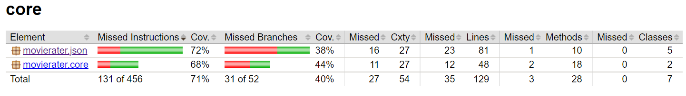

# Release 1

## Om appen

MovieRater er en applikasjon som hjelper deg med å holde oversikt over filmer du har sett eller ønsker å se. Appen gir deg mulighet til å legge til filmer, med tittel, utgivelsesår, rating og kommentar, samt velge om du har sett eller ikke sett filmen. Filmene blir vist i en tabell, og filmlisten lagres lokalt slik at du ikke mister filmene du har lagt til. 

For mer informasjon om hvordan appen skal se ut når den er ferdig, les mer [her](../movierater/README.md).

## Utgangspunkt
Vi tok utgangspunkt i [brukerhistorie 1](Brukerhistorier.md) for denne iterasjonen. 

## Arbeidsfordeling
Sigve Hov har jobbet med JSON fillagringsimplementasjonen.

Martin Bråten Isaksen har jobbet med domenelogikken og brukergrensesnittet til applikasjonen.

Martin Vu har jobbet som scrummaster, oppsett av prosjektet og support på alle delene.

Lasse Buljo har jobbet med dokumentasjonen av prosjektet.

## Funksjonalitet i release 1
- Funksjonalitet for å legge til filmer, med mulighet for å legge til år, vurdering (rating), kommentar og status for sett/ikke sett.
- Funksjonalitet for å fjerne filmer.
- Fillagring med JSON.

Fillagringen skjer automatisk når en legger til eller sletter en film. Foreløpig blir data lagret lokalt i data.json i fxui. 

## Fremtidig funksjonalitet
- Funksjonalitet for sortering av filmer etter år, rating, og sett/ikke sett.
- Funksjonalitet for innlogging via en forside med brukernavn.
- Mulighet for redigering av tittel, år, rating, kommentar og sett/ikke sett på enkeltelementer i tabellen.

Foreløpig vil det bli utløst en feilmelding hvis en prøver å legge til film som ikke har tittel, år og rating. Dette tenker vi å håndtere ved å deaktivere "Add movie"-knappen til disse feltene er fylt ut. 

## Tester
Vi har testet disse klassene:

- Film
    - Testet konstruktør med data, samt tom konstruktør.

- FilmList
    - Testet konstruktør med data, samt tom konstruktør.

- FilmModule
    - Testet serializer og deserializer, for så teste begge samtidig.

Vi har foreløpig ikke testet brukergrensesnittet. Dette kommer i neste iterasjon av prosjektet. 

## Testdekningsgrad
Rapport fra JaCoCo:

