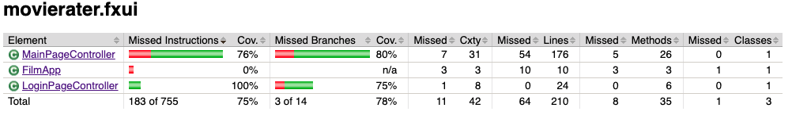
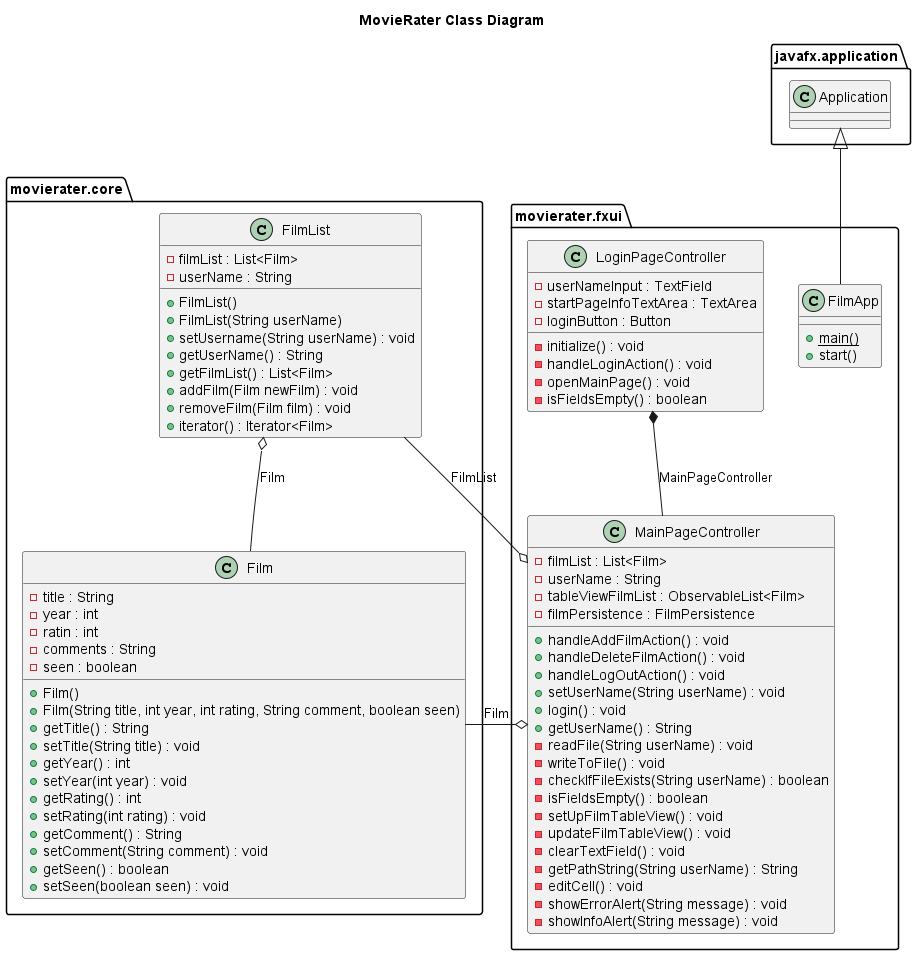

# Release 2

## Om appen

MovieRater er en applikasjon som hjelper deg med å holde oversikt over filmer du har sett eller ønsker å se. Appen gir deg mulighet til å legge til filmer, med tittel, utgivelsesår, rating og kommentar, samt velge om du har sett eller ikke sett filmen. Filmene blir vist i en tabell, og filmlisten lagres lokalt slik at du ikke mister filmene du har lagt til. 

For mer informasjon om hvordan appen skal se ut når den er ferdig, les mer [her](../movierater/README.md).

## Utgangspunkt
Vi tok utgangspunkt i [brukerhistorie 2, 3 og 4](Brukerhistorier.md) for denne iterasjonen. 

## Funksjoner i release 2
- Forside til innlogging (brukerhistorie 3)
- Redigere enkeltceller for et filmobjekt (brukerhistorie 4)
- Implisitt lagring på fil med samme navn som brukernavnet som blir tastet inn. 
- Deaktivere "Add Movie"-knappen fram til man har tastet inn tittel, år og rating. 

Brukerhistorie 2 beskriver at man har lyst til å sortere filmene etter forskjellige kriterier. Vi trengte ikke lage en funksjon for dette, da TableView fikser dette automatisk. 

Vi har valgt å bruke implisitt lagring siden det er mer brukervennlig. Da slipper brukeren å huske på å trykke lagre hver gang en endring blir gjort, og om noe uforutsett skulle skje så mister ikke brukeren all data. Det blir opprettet en fil om brukeren taster inn et nytt brukernavn, og filen heter det samme som brukernavnet. F.eks hvis brukeren taster inn "Nordmann" som brukernavn, blir det lagret en fil som heter "nordmann.json" under resources i main på fxui-pakken. 

Under er et eksempel på lagringsformatet vårt i JSON. Her er brukernavnet data, og filmlisten inneholder ett filmobjekt. 

{
  "username" : "data",
  "filmlist" : [ {
    "title" : "TestTitle",
    "year" : 2020,
    "rating" : 8,
    "comment" : "Test Comment",
    "seen" : true
  } ]
}

### Andre inklusjoner og endringer i release 2:
- Popup-alerts ved inntasting av brukernavn med feil format (f.eks. tall og symboler) og opprettelse av ny bruker.
- Lagt til FilmPersistence-klasse for å kapsle inn bruken av jackson. Andre klasser kan bruke denne for å lese fra og skrive til JSON.
- Økt testdekniningsgrad og kodekvalitet

## Fremtidig arbeid
- Øke kodekvalitet/utvide funksjonalitet
- Flere tester for brukergrensesnitt og rette opp i potensielle bugs i testene.
- REST API med springboot
- Integrasjonstester

### Potensielle bugs
Testene for brukergrensesnitt fungerer ikke optimalt i gitpod. Dette gjelder særlig test for redigering av filmelementer (testEdit). Testene gir enkelte ganger feil de første gangene man kjører mvn clean install i gitpod, men blir som regel riktig etter å ha bygget et par ganger. 

Mulig dette er en bug kun med gitpod da testene kjører uten feil lokalt på alle våre IDEer. 

Vi skal uansett prøve å utbedre dette til neste release. Foreløpig er denne koden kommentert ut, slik at gitpod bør kjøre riktig. 

## Tester
Vi har laget tester for alle modulene og brukt JaCoCo-rapportene aktivt for å forbedre testene. 

### core (100%)
Lagt til flere tester:
- Film (100%)
- FilmList (100%)

Rapport fra JaCoCo:

### JSON (100%)
- Lagt til flere tester for håndtering av ulik/feil tekstformat og ulike scenarior for deserialisering og serialisering. 
- Lagt til tester for den nye klassen FilmPersistence. 

Rapport fra JaCoCo:

### fxui (75%, 78% på missed branches)

- Alle testene for brukergrensesnitt er lagt i FilmAppTest.java som tester både LoginPageController og MainPageController.

- Lagt til tester for å sjekke at kontrolleren blir initialisert, logge inn, logge ut, opprette ny bruker, login med feil brukernavnformat, legge til film, slette film og redigere filmelementer*. 

*Testen for å redigere er som tidligere nevnt kommentert ut i koden, da den ikke kjører optimalt i gitpod.

Rapport fra JaCoCo (uten testen for å redigere filmelementer):

## Arkitektur

Arkitekturen består av egen pakke for domenelogikk (core), fillagring (json) og brukergrensesnitt (fxui). 

Under er det lagt ved pakkediagram og klassediagram.
Mer informasjon om arkitektur i README-filen til MovieRater [her](../movierater/README.md).

Pakkediagram: 

Klassediagram:

## Arbeidsvaner

### Workflow
Brukerhistoriene ligger til grunn for alt arbeidet og vi har laget issues basert på disse. Issuene legges til i milestone "Andre release" for å knytte dem sammen. Deretter har vi assignet issues til hvert enkelt gruppemedlem, og laget branches med samme navn som issuet. Dette gjør at issuet automatisk blir lukket når branchen merges til main. Når et issue er ferdig, pulles main inn i branchen for å unngå mergekonflikt senere. En merge-request blir laget og en annen person i gruppen vil gå inn i branchen og se at alt fungerer som det skal før det blir merget til main. På denne måten sørger vi for at kun kode som fungerer pushes til/merges med main. 

Bruken av issues og merge-requests kan bli enda mer standardisert ved å lage gitlab templates. Dette tenker vi å inkludere i arbeidet til neste innlevering.  

I denne sprinten har vi valgt å splitte opp issuene i koding av nye implementasjoner og testing av koden for de ulike delene, noe som til ettertanke kan ha vært litt uheldig da det ble vanskeligere å teste når koden ble mer komplisert. 
Forbedring kan være å legge til testing som en del av implementasjon av nye funksjoner, slik at koden alltid testes underveis. Dette vil kunne øke kodekvaliteten samtidig som arbeidet med å lage tester blir mindre overveldende.

### Git Commits
Vi har prøvd å følge god praksis for git commit meldinger med bruk av presens og kapitalisert første bokstav (Add, Update, Merge, etc.) og prøvd å knytte logiske endringer sammen. Vi har valgt å kun skrive en oppsummering av endringen i commit-meldingene og deretter linke til issuet den løser. 

Mulige forbedringer kan være å følge konvensjonen til Conventional Commits med å bruke fix, feat, bug etc. Eventuelt å legge til body-tekst i commit-meldingene slik at det kommer tydeligere fram hva slags endring og hvorfor endringen ble gjort. Vi kan også bli bedre til å skrive flere fokuserte commits, slik at vi ikke inkluderer alt for mye i en enkelt stor commit. 

### Arbeidstider og parprogrammering
Gruppen har holdt arbeidsmøter fysisk kl 10 hver tirsdag og torsdag. Disse arbeidsmøtene har vi brukt til å planlegge hva som må gjøres, se gjennom koden sammen og til parprogrammering. 

Sigve og Lasse har jobbet i par, og Martin Vu og Martin Isaksen har jobbet i par. Dette innebærte at vi byttet på å kode (driver) og observere (navigator). IDE utvidelsene Live Share og CodeTogether ble brukt for å støtte dette. I tillegg har vi hjulpet hverandre på tvers der det har vært behov. Utenom tirsdag og torsdag har vi jobbet individuelt.

## Arbeidsfordeling

Martin Bråten Isaksen har jobbet med å lage forside til brukergrensesnittet og tilhørende kontroller. Han har laget tester slik at core har 100% testdekningsgrad og lagd en funksjon for å redigere enkeltceller. Han har rettet opp i bugs, laget JavaDoc-kommentarer og UML-diagrammer. 

Martin Vu har jobbet med testing av JSON og brukergrensesnitt, fiksing av bugs, samt samhandling mellom LoginPageController og MainPageController. 

Sigve Hov har jobbet med testing av brukergrensesnittet.

Lasse Buljo har jobbet med testing av brukergrensesnittet og funksjonen for å redigere enkeltceller, samt litt finpussing av dokumentasjonen.

Siden Martin Vu og Martin Isaksen jobbet med brukergrensesnittet i forrige release, jobbet de med testing av JSON denne releasen. Dette var for å sette seg bedre inn i koden for fillagringen. Sigve jobbet med JSON forrige release, og derfor jobbet han og Lasse med testing av brukergrensesnittet.

## Kodekvalitet

Vi har jobbet med å forbedre kodekvaliteten ved å gå gjennom ny kode i felleskap på arbeidsmøtene. Slik har vi avdekket dårlig praksis og gjort forbedringer i koden. Dette er noe vi kommer til å fortsette med til neste innlevering.

I tillegg har vi:

- Økt testdekningsgrad ved hjelp av JaCoCo-rapportene.

- Lagt til sjekk med Spotbugs og gjort forbedringer i koden for å unngå bugs. 

- Lagt til plugin (fmt-maven-plugin) i pom-filene som automatisk formatterer kode når prosjektet bygges i maven. Denne er konfigurert til å følge Google Java Style. 

- Lagt til Checkstyle-plugin som sjekker at koden er formattert riktig. Vi har også brukt advarslene og eventuelle checkstyle-errors fra denne til å forbedre lesbarheten av koden og lagt til JavaDoc-kommentarer. 

