# Release 3

## Om appen

MovieRater er en applikasjon som hjelper deg med å holde oversikt over filmer du har sett eller ønsker å se. Appen gir deg mulighet til å legge til filmer, med tittel, utgivelsesår, rating og kommentar, samt velge om du har sett eller ikke sett filmen. Filmene blir vist i en tabell, og filmlisten lagres lokalt slik at du ikke mister filmene du har lagt til. Du kan også lage flere filmlister, f.eks. ha en filmliste for en bestemt sjanger.

For mer informasjon om appen, les mer [her](../movierater/README.md).

## Utgangspunkt
Vi tok utgangspunkt i [brukerhistorie 5 og 6](Brukerhistorier.md) for denne iterasjonen når vi skulle utvide funksjonalitet i appen. Vi har også lagt til springboot restserver, rest-api og integrasjonstester.

## Funksjoner i release 3

Fxui:
- Muligheten for å legge til flere filmlister per bruker
- Deaktivere "slett filmliste"-knappen hvis det kun er en filmliste igjen
- Deaktivere "slett film"-knappen hvis en film ikke er valgt
- Knapp for å slette bruker og popup for å bekrefte valget.
- Velge "Remote" eller "Direct" access ved login.

Restserver (REST-API):
- Spring Boot rammeverk
- Vi har lagd et REST-API med metoder for å:
  - legge til/oppdatere (POST) en bruker
  - hente (GET) en bruker fra datakilde
  - slette (DELETE) en bruker
- Dokumentasjon for REST API [her](restapi.md)

Funksjonaliteten vi har utvidet appen med fra brukerhistorie 5 er at en bruker kan ha flere filmlister. For å få dette til har vi laget en ny klasse i core som heter User.java. User-klassen har et brukernavn og en hashmap som kan inneholde flere filmlister. Hashmap'et gjør at vi kan tilordne en unik nøkkel til hver filmliste slik at alle filmlister kan identifiseres ved hjelp av denne nøkkelen.

For brukerhistorie 6 har vi laget en knapp slik at brukeren kan slette brukeren sin, hvis det er ønskelig. Før en sletter brukeren vil man få en advarsel og man må bekrefte at en ønsker å slette brukeren sin.

Siden vi gjorde det mulig for en bruker å ha flere filmlister, har lagringsformatet i JSON blitt noe annerledes fra release 2. Vi har valgt å benytte Jackson-biblioteket sin innebygde metode for å serialisere og deserialisere objekter. Siden vår tilpassede json modul fra release 1 og 2 med egendefinerte metoder for serialisering/deserialisering i utgangspunktet fungerer nesten helt likt som jackson sitt innebygde, har vi valgt å fjerne den. Dermed inneholder json-pakken nå kun en UserPersistence-klasse som serialiserer/deseriaiserer (ved hjelp av Jackson) og leser og skriver til fil. Dette gjør json-pakken vår mye mer håndterbar.

For eksempel av json formatet, se dokumentasjonen for REST API.

I tillegg har vi lagt til mulighet for å velge "Direct" (persistens uten bruk av restserver) eller "Remote" (med restserver) access når du logger inn. Dette tok ikke utgangspunkt i noen brukerhistorie, men vi ønsket å beholde muligheten for at appen skal fungere selv uten server kjørende. Ved å logge inn med  "Direct" access, vil appen lagre data direkte til brukerens hjemmemappe. Med "Remote" access krever appen at serveren er oppe og kjører for å kunne bruke appen. 
## Tester

JaCoCo testdekningsgrad:

### Core (100%)

- Oppdatert med tester for ny User-klasse

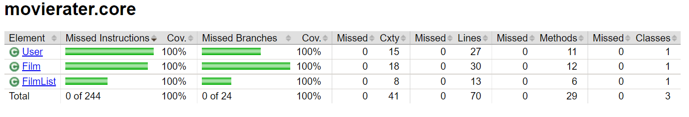

### JSON (100%)

- Oppdatert med kun tester for den nye UserPersistence-klassen

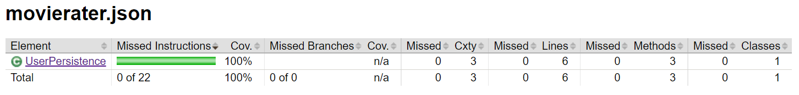

### Fxui (89%)
- Oppdatert tester for å dekke ny funksjonalitet og å øke testdekningsgrad.
- Tester appen uten server kjørende ved bruk av en mock for Data Access og Direct access. 
- Lagt til profil for "headless"-testing av fxui, slik at testene kan kjøres i bakgrunnen (denne bruker javafx 12 og gir en warning, men testene kjører uten problemer).

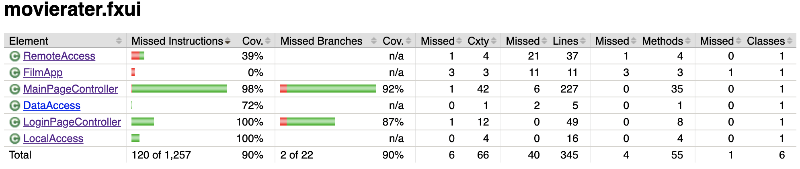

### Restserver (100%)

- Bruker MockMVC for å teste at alle delene av restserveren fungerer i lag. 

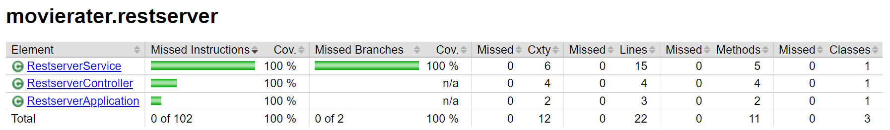

### Integrasjonstester
Hensikten med integrasjonstestingen er for å teste at de individuelle modulene fungerer i samspill med hverandre for at applikasjonen skal fungere i en helhet. Dette innebærer testing av core, fxui og restserver i lag. I hovedsak sjekker testene at fxui-et får til å sende og hente data til/fra REST API-serveren som dermed kan lagre og tilgjengeliggjøre dataen. 

Integrasjonstesten starter restserveren og går gjennom et bruksscenario av appen der en ny bruker logger inn, legger til filmliste, legger til film, sletter filmlista og til slutt sletter brukeren. 

For integrasjonstesten, genererer JaCoCo en samlet rapport for hele prosjektet:

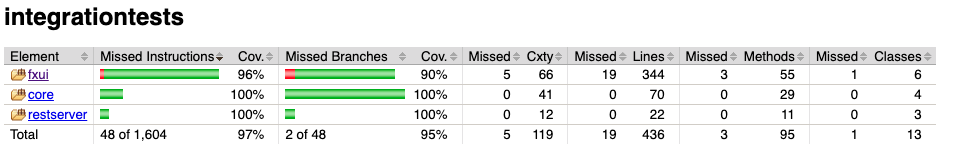

## Arkitektur

Arkitekturen består av egen pakke for domenelogikk (core), fillagring (json), brukergrensesnitt (fxui), restserver (restserver) og tilhørende integrasjonstester (integrationtests).

Under er det lagt ved pakkediagram, klassediagrammer og sekvensdiagram.
Mer informasjon om arkitektur finner du i README-filen til MovieRater [her](../movierater/README.md).

Pakkediagram:

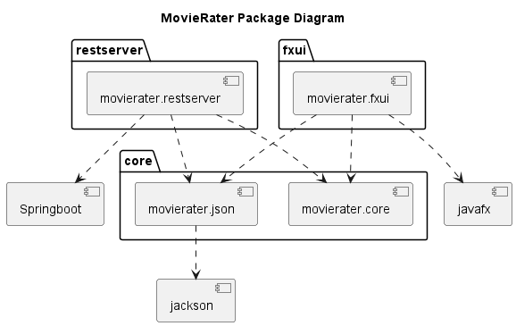

Klassediagrammer:

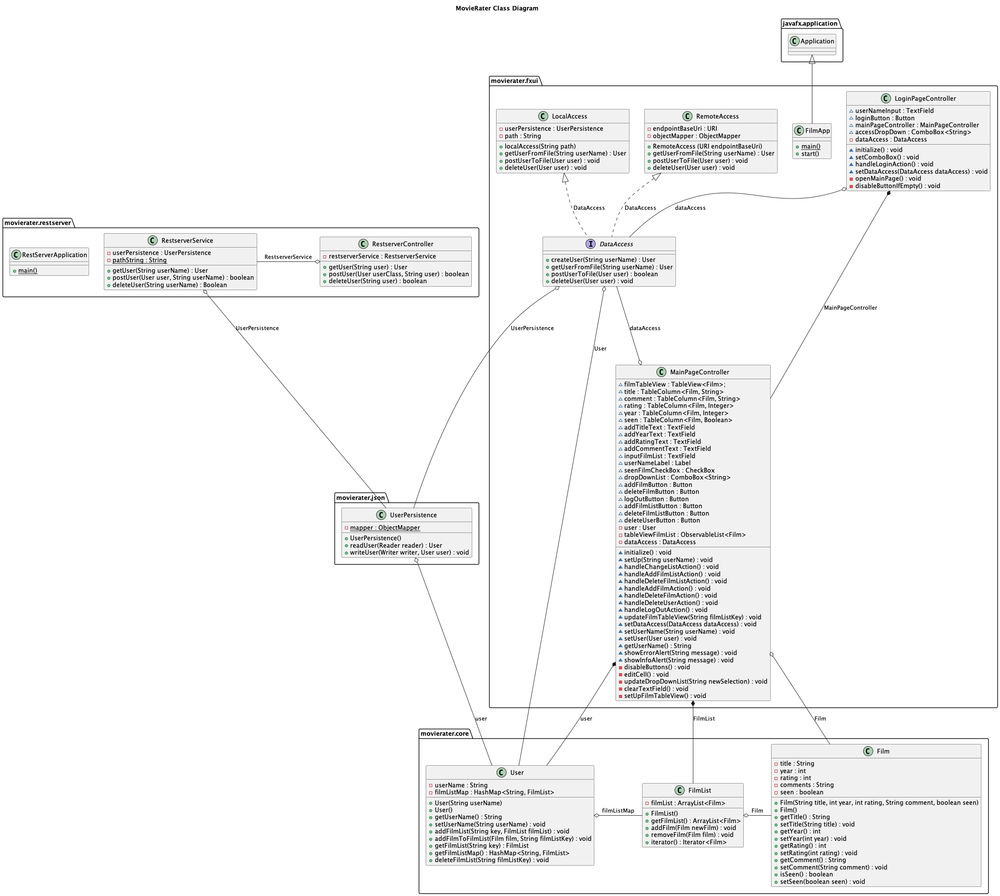

Core:
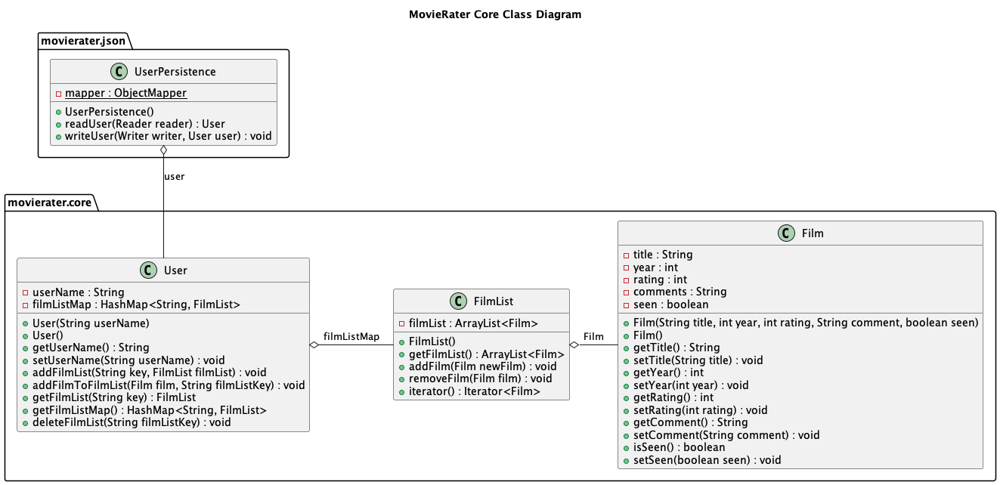

Fxui:
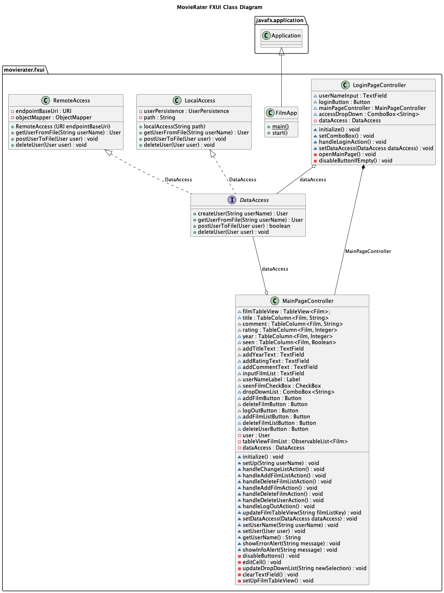

Restserver:
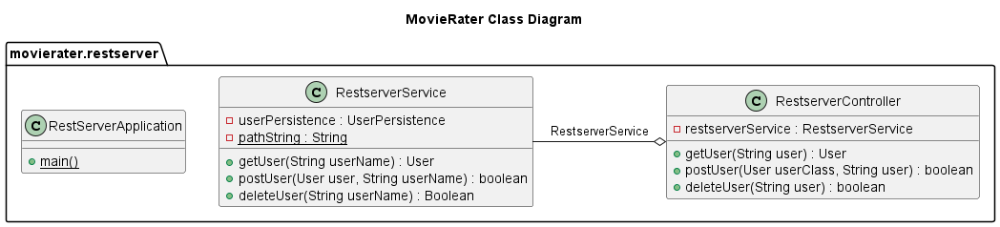

Sekvensdiagrammet viser et brukstilfelle hvor en bruker legger til en film:

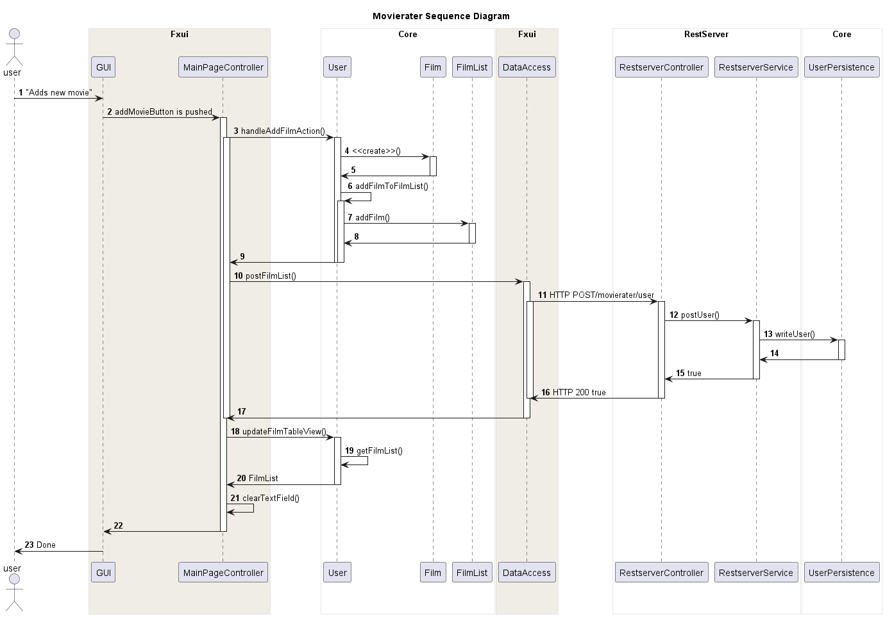

## Arbeidsvaner
Vi fortsatte å møte opp hver tirsdag og torsdag. Gruppemedlemene har jobbet med prosjektet individuelt utenom disse dagene. Generelt har vi fortsatt med de samme arbeidsvanene som fungerte bra i release 2 og prøvd å forbedre der vi kan.

### Workflow

Mesteparten av tiden og energien på denne releasen gikk inn i implementering av REST API. Vi har laget issues og knyttet de til milestone "Third release". Vi har opprettet Gitlab-templates for issues slik at disse blir mer beskrivende og standardisert. Vi har et template for standard issues og et for bugs. Vi har også laget template for merge requests. 

En annen ting vi har forbedret fra release 2 er at vi vært bedre til å skrive tester underveis når vi har implementert nye funksjoner. 

### Git commits

Vi har fortsatt samme praksis for git commits som for release 2 med kun kort beskrivende oppsummering for hver commit. Dette syntes vi har fungert greit, ettersom vi gikk mer i detalj i hver issue og tilhørende merge request for endringene som ble gjort.

## Arbeidsfordeling
- Martin Bråten Isaksen har jobbet med integrasjonstesting, oppsett av restserver og dokumentasjon.

- Martin Vu har har utvidet filmliste funksjonen med bruker, samt mapping av REST-API.

- Sigve Hov har jobbet med oppsett av restserver, dokumentasjon og kodekvalitet.

- Lasse Buljo har jobbet med mapping av REST-API samt dokumentasjon og skriving av JavaDocs-kommentarer.

## Kodekvalitet

Vi har fortsatt sjekk med spotbugs, checkstyle og JaCoCo for testdekningsgrad. Vi har gjort code reviews gjennom muntlige eller skriftlige tilbakemeldinger før hver mergerequest, enten digitalt eller fysisk. En person lager en merge request og en annen går inn i branchen og sjekker at alt fungerer og leter etter potensielle bugs. 

I tillegg har vi fjernet kode som er ubrukt.

## Mulige forbedringer

- Splitte opp MainPageController og tilhørende FXML

Selv om flere mindre kontrollere kanskje kan gjøre koden mer håndterbar i lengden, har vi valgt å ikke fokusere på dette i denne releasen, siden dette blant annet skaper utfordringer med å sende data mellom kontrollere (ga blant annet bugs med spotbugs). I tillegg har arbeidet med restserver tatt såpass lang tid at dette ikke er blitt prioritert. 

En naturlig måte å dele opp kontrolleren på ville vært å ha en egen kontroller for User-delen av appen som styrer en kontroller for FilmList-delen (der man kan se og slette/legge til filmer). FilmList-delen kan også splittes ytterligere til en egen del for FilmList-TableView og seksjon for å legge til film.

