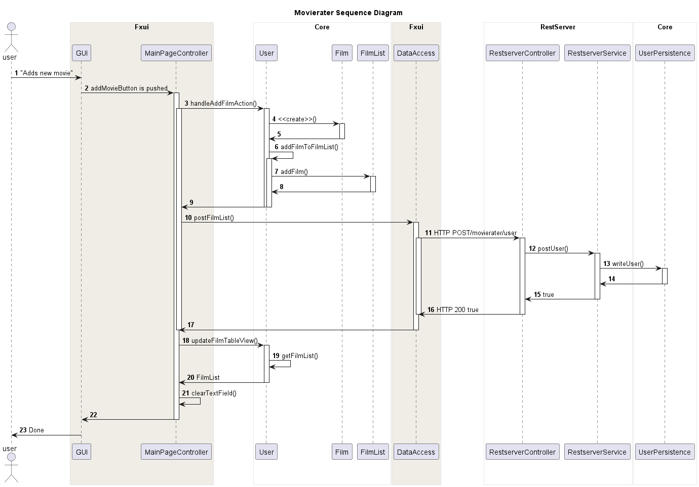

# MovieRater
MovieRater er en applikasjon som hjelper deg med å holde oversikt over filmer du har sett eller ønsker å se. Appen gir deg mulighet til å logge inn med brukernavn og ha flere filmlister der du kan legge til filmer, med tittel, utgivelsesår, kommentarer, rating og om du har sett eller ikke sett filmen. Filmene vises i en tabell som kan sortere filmene etter de ulike feltene.  

Appen støtter lagring direkte lokalt eller via et REST API til en restserver.
Dataene lagres implisitt til json-fil, slik at all data lagres idet man legger de til eller gjør endringer i appen. 

## Mockup Illustrasjonsbilder:

Under har vi mockup-bilder av hvordan vi tenkte at appen skulle se ut når den ble ferdig. 

Ved oppstart av appen kan en logge på med brukerinfo:

Hovedsiden med oversikt, mulighet for å legge til/slette film og filtrere listen:

## App Illustrasjonsbilder:

Under har vi illustrasjonsbilder fra den ferdige applikasjonen

Endringer fra mockup:
- Kan velge "access"-type på login-siden, "Remote" eller "Direct"
- Sortering skjer gjennom tabell framfor radio-buttons på siden
- Små designendringer
- Lagt til knapp for å logge ut
- Mulighet for å legge til flere filmlister
- Knapp for å slette bruker 
- "Sett"/"ikke sett" indikeres med true/false

Login-siden:

Hovedsiden:

## Moduler
Prosjektet er strukturert med disse modulene:
- Domenelogikk ([core](core/README.md))
- Brukergrensesnitt ([fxui](fxui/README.md))
- Integrasjonstester ([integrasjonstester](integrationtests/README.md))
- Restserver ([restserver](restserver/README.md))

### Pakkediagram:

Pakkediagrammet under viser arkitekturen til prosjektet. Domenelogikk (core) og persistens (json) ligger i core-modulen. Json-pakken har avhengighet til jackson-biblioteket. Fxui-pakken har avhengighet til core-modulen, og til javaFX for brukergrensesnitt.

### Klassediagram:
Under ser vi klassediagrammet for core-pakken, fxui-pakken og restserver-pakken. 

### Sekvensdiagram:
Under ser vi et sekvensdiagram hvor en bruker legger til en film. 

