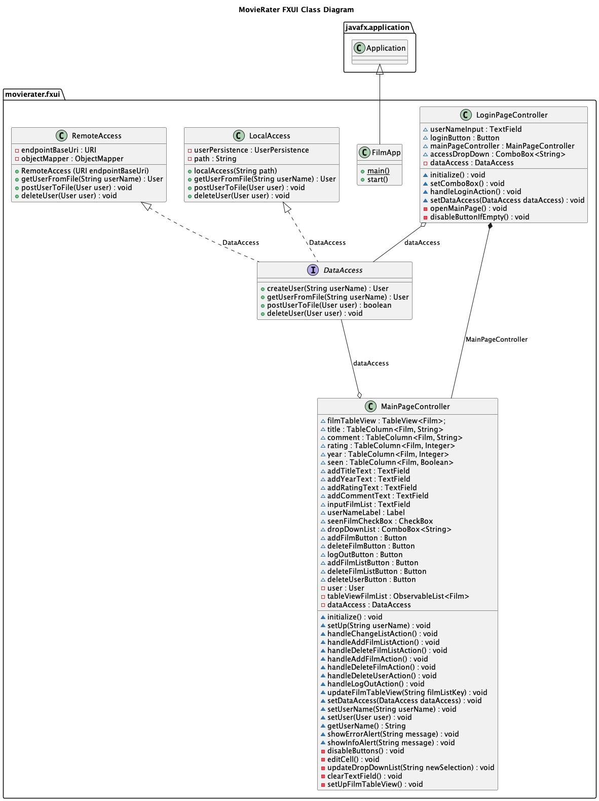

# FXUI
Fxui inneholder brukegrensesnittet, som består av klassene:

- DataAccess.java er et interface for å kunne lagre data. Blir implementert av LocalAccess og RemoteAccess.   
- FilmApp.java som brukes for å starte applikasjonen og åpner opp login-siden.
- LocalAccess.java lagrer og henter data direkte fra fil.
- LoginPageController.java som er kontrolleren for login-siden (LoginPage.fxml). 
- MainPageController.java som er kontrolleren for hovedsiden (MainPage.fxml). 
- RemoteAccess.java kommuniserer med restserveren.

LoginPage:
- Består av et inputfelt for brukernavn og en login-knapp som logger deg inn til MainPage. 
- Inputfeltet aksepterer kun bokstaver og gir feilmelding dersom noe annet blir skrevet inn. 
- Ved innlogging av ny bruker, får man en infomelding om at ny bruker er opprettet, før appen logger deg inn til MainPage.
- Kan velge mellom RemoteAccess og DirectAccess. Hvis en ikke velger en av de får man ikke logget inn. 

MainPage: 
- Inneholder all funksjonalitet til appen. 
- Visning av alle filmene i valgt filmliste i tabell-view.
- Viser hvilken bruker som er logget inn.
- Sortering ved å trykke på tabelltitlene. 
- Kan legge til nye filmer med tittel, år, rating, kommentar og sett/ikke sett.
- Kan slette film ved å markere valgt film og deretter trykke "Delete movie". 
- Kan redigere enkeltelementer ved å dobbeltrykke på elementet. 
- Logg ut-knapp som fører deg tilbake til LoginPage.
- Mulighet til å legge til flere filmlister
- Mulighet for å slette en filmliste
- Mulighet for å slette brukeren

### Klassediagram fxui
Under har vi klassediagrammet for fxui:

